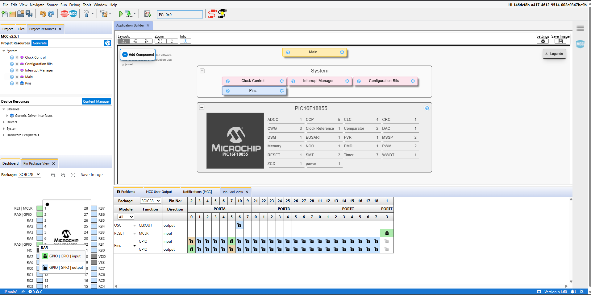
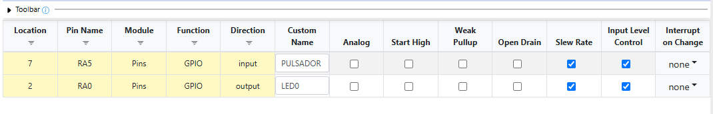
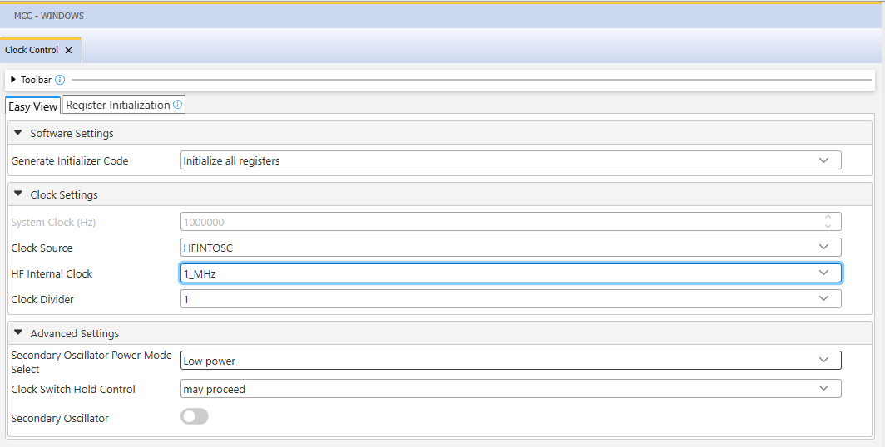
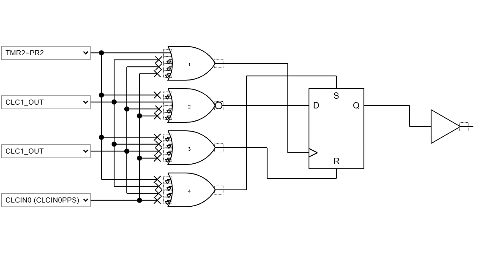

# PIC16F877A

## 1. Historia
El PIC16F877A es un microcontrolador de 8 bits desarrollado por Microchip Technology, lanzado en el 2010 como parte de la familia PIC16. Tiene un bajo consumo de energía y alta capacidad para aplicaciones embebidas gracias a funciones como Core Independent Peripherals (CIP), convertidores analógico-digitales (ADC) de alta resolución y comunicación serial avanzada (I2C, SPI, UART). Es compatible con el entorno de desarrollo MPLAB X y el compilador XC8, lo que facilita su programación y depuración en aplicaciones industriales y educativas.


**Figura 1: Diagrama del microcontrolador PIC16F877A**


*Fuente: Microchip Technology*

---


### 1.1. Carácteristicas

A continuación, de describen las características básicas de acuerdo con Microchip Technology[^1] del microcontrolador PIC16F877A

| Característica                  | Valor     |
|-------------------------------|-----------|
| Program Memory Size (KB)       | 14        |
| RAM                            | 1024      |
| Data EEPROM (bytes)            | 256       |
| Pin Count                      | 28        |
| Operation Voltage Max. (V)     | 5.5       |
| Operation Voltage Min. (V)     | 1.8       |


### 1.2. Diferencias entre un Microcontrolador y un Microprocesador

A diferencia de los microprocesadores, el PIC16F877A (el cual es un microcontrolador ) no consta de un sistema operativo para su funcionamiento. En lugar de eso, está diseñado para ejecutar directamente código embebido escrito en lenguajes como C o ensamblador, sin necesidad de capas intermedias de software. Esto lo hace ideal para aplicaciones específicas donde se requiere una respuesta rápida, bajo consumo de energía y alta integración de periféricos en un solo dispositivo.
Su capacidad de procesamiento es menor, pensado precisamente para tareas de menor complejidad, analizando sus entradas y salidas (I/O) en base a sus componentes internos y cambios de voltaje.

| Característica               | Microcontrolador (ej: PIC16F877A)     | Microprocesador                        |
|-----------------------------|----------------------------------------|----------------------------------------|
| Integración                 | Incluye CPU, memoria, I/O y periféricos| Solo contiene la unidad central de proceso (CPU) |
| Propósito                   | Aplicaciones embebidas específicas     | Computadoras generales o sistemas complejos |
| Programación                | Fácil de programar con lenguajes simples| Requiere sistema operativo y software complejo |
| Costo                       | Bajo                                   | Alto                                   |
| Consumo de energía          | Bajo                                   | Generalmente más alto                  |

Los microcontroladores como el PIC16F877A están optimizados para tareas específicas, mientras que los microprocesadores son más potentes pero requieren más componentes externos y recursos.

---

## 2. Usos del PIC16F877A

El PIC16F877A tiene usos en sistemas embebidos donde se requiere bajo consumo energético, una programación simplificada en C++ o ASEMBLY. Entre sus usos más comunes se encuentran:

- Automatización industrial (control de motores, monitoreo de sensores).
- Domótica (control de luces, cerraduras, temperatura).
- Equipos médicos portátiles.
- Electrónica de consumo (juguetes inteligentes, electrodomésticos).
- Sistemas educativos para enseñanza de programación y electrónica básica.
- Prototipos de IoT cuando se combinan con módulos de comunicación externa.

Gracias a sus periféricos independientes del núcleo (CIP), puede ejecutar tareas simples sin requerir constantemente la intervención del procesador, optimizando así el consumo de energía.


---

## 3. Entorno de programación 

Para poder programar al PIC16F877A se utiliza el **IDE MPLAB ® Xpress IDE** ofrecido por Microship Technology[^2], siendo una herramienta que aporta flexibilidad, permitiendo programar, depurar y cargar el código al PIC16F877A.

**Figura 2: Logo de MPLAB**


*Fuente: Microchip Technology*

Dentro de MPLAB se usará MCC (MPLAB ® Code Configurator), para poder asignar las entradas y salidas a cada pin correspondiente para los ejemplos a continuacion.
Este entorno es gratuito y se trabaja en la nube, facilitando su uso en distintas plataformas.

---

## 4. Ejemplos de Aplicación

Los ejemplos a demostrar en este informe son obtenidos del libro "Programación de microcontoladores PIC paso a paso"[^3] de Carlos Ruiz Zamarreño

### 4.1. **Control de un LED por pulsador**
Dentro de MCC se crea el nombre del proyecto (menú File -> media de microcontroladores) con el nombre *LED PULSADOR*, luego en la ventasna Project Resources se asigna los terminales RA0 y RA5 como salida y entrada digital respectivamente, tal como muestra la figura 3.

**Figura 3: Asignación de terminales**



*Fuente: MPLAB Xpress*

Luego se asignan nombres a cada uno de los terminales para poder ser referenciados posteriormente en el programa, siendo *PULSADOR* para RA5 y *LED0* para RA0, tal como se ve en la figura 4:

**Figura 4: Cambio de nombre terminales**



*Fuente: MPLAB Xpress*

En la figura 5 se muestra que se debe configurar el reloj interno en 1MHZ para psoteriormente generar el archivo main.c.

**Figura 5: Ajuste de reloj interno**



*Fuente: MPLAB Xpress*

Finalizando con salir del MCC para ir al archivo main.c y programar la condición de cuando haya un cambio en el pulsador, que se active o desactive el LED.

```c
#include "mcc_generated_files/system/system.h"

/*
    Main application
*/

int main(void)
{
    SYSTEM_Initialize();
      while(1)
    {
        if(PULSADOR_GetValue()==0) LED0_Toggle();
    }    
}

```

De acuerdo con el autor, se podrían detectar errores de que se deba de pulsar más de una vez para cambiar el estado del LED y esto se debería a la velocidad de ejecución del programa, se propone como idea poner unos delays de 20ms entre cada pulzación, sin embargo, el autor indica que hay formas más eficientes de resolver esto, sin perder ciclos de ejcución en la espera. Para esta solución se usan los modulos integrados en el microcontrolado (timers 2, 4 y 6) que realizan la función de forma autónoma.
Acomodando las conexiones de acuerdo a esta configuración, no sería necesario programar el PIC16F877A propiamente tal, sino que modificar como interactuan las compuertas entre sí, dentro del MCC, tal y como se presenta en la figura 6.

**Figura 6: Ajuste CLC**



*Fuente: MPLAB Xpress*

En esta configuración, se conecta el evento TMR2=PRD a la salida biestable, con su salida CLC1 negada a la entrada *D*, por último se deconectan el resto de salidas CLC1_OUT. Esto da como resultado la funcionalidad anterior, con un margen de 50ms entre pulsación para evitar errores o falsos positivos al querer activar o desactivar el LED.


---

## Conclusión

El microcontrolador PIC16F877A es una excelente opción para desarrolladores en busqueda de soluciones económicas y versátiles para sistemas embebidos. Sus periféricos integrados, bajo consumo de energía y facilidad de programación lo hacen ideal tanto para aplicaciones industriales como educativas. Como fue visto en el ejmplo tomado de la literatura, existen distintas vías para la obtención de los mismos resultados, siendo algunos enfocados en la suma de compuertas lógicas y otros en la programación.
La indagación de futuros proyectos usando el PIC16F877A podría solucionar problemas sencillos que anteriormente se han resuelto con Arduinos (malgastando todo el poder de los microcontroladores que lo componen), siendo una respuesta más eficiente.

---

## Referencias

[^1]: Microchip Technology, s.f. "PIC16F18855". https://www.microchip.com/en-us/product/pic16f18855#Overview
[^2]: Microchip Technology, s.f. "MPLAB® Xpress Cloud-Based IDE". https://www.microchip.com/en-us/tools-resources/develop/mplab-xpress
[^3]: Carlos Ruiz Camarreño, 2021. "Programación de microcontoladores PIC paso a paso". https://feriachilenadellibro.cl/producto/9786075387413-programacion-de-microcontroladores-pic-paso-a-paso/
